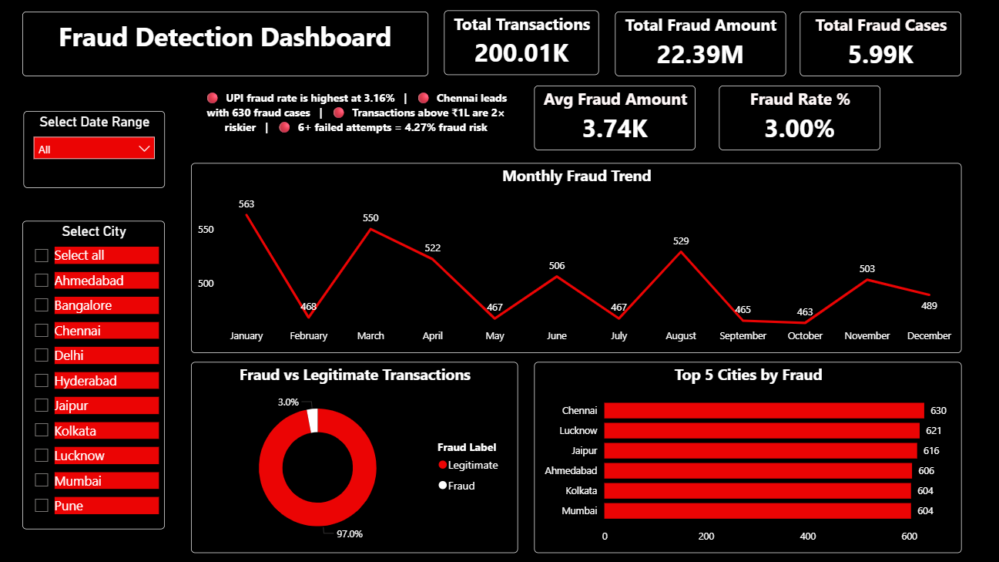
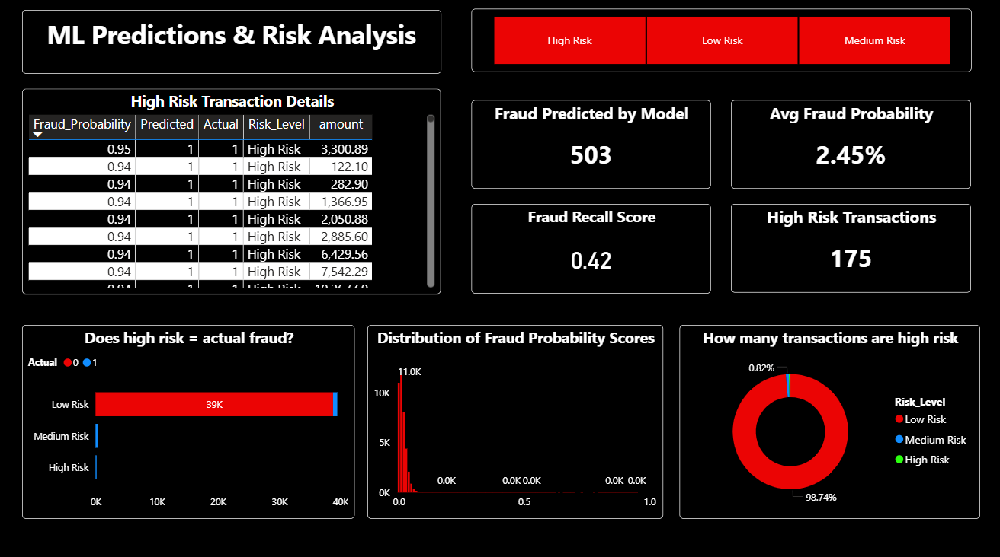
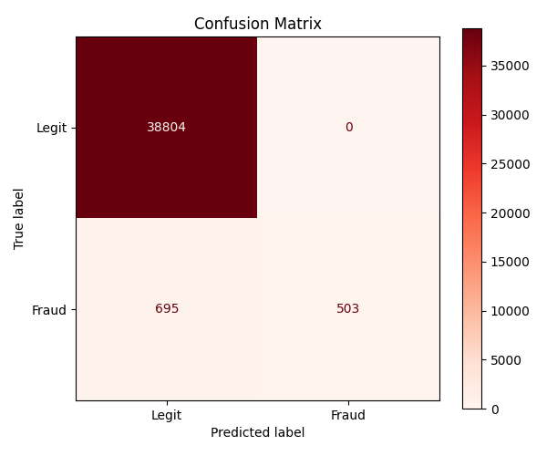
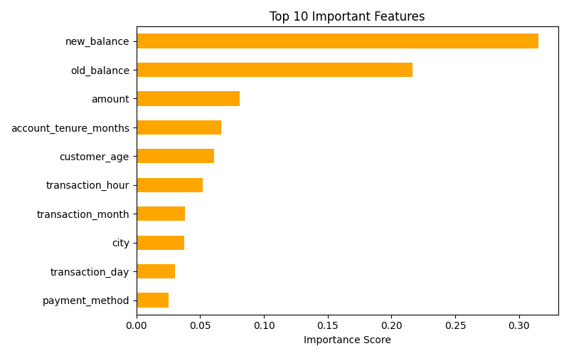

# 🛡️ Financial Fraud Detection & Transaction Risk Analysis

> **End-to-End Data Science Project** — EDA · SQL Analysis · Machine Learning · Power BI Dashboard

---

## 📌 Project Overview

This project tackles one of the most critical challenges in the FinTech industry — **detecting fraudulent financial transactions** before they cause damage. Using a dataset of **200,000+ real-world-style transactions**, I built a complete data science pipeline from raw data ingestion to an interactive business dashboard.

The project covers every layer of a professional data workflow:

- 🔍 **Exploratory Data Analysis (EDA)** & Data Cleaning
- 🗄️ **SQL-based Business Analysis** for fraud pattern discovery
- 🤖 **Machine Learning** using Random Forest with Risk Scoring
- 📊 **Power BI Dashboard** with 5 interactive report pages

---

## ❗ Problem Statement

Financial fraud is a rapidly growing threat in the digital payments ecosystem. According to industry reports, global payment fraud losses exceed **$40 billion annually**, and India's UPI/digital payment boom has made it a prime target for fraudsters.

**The core challenges this project addresses:**

- 🔴 **Imbalanced Data** — Only 3% of transactions are fraud. A naive model that predicts "Not Fraud" for everything achieves 97% accuracy but catches zero criminals.
- 🔴 **Real-time Detection Need** — Fraud decisions must be made in milliseconds without disrupting genuine customers.
- 🔴 **High Cost of Errors** — A **False Negative** (missed fraud) causes direct financial loss. A **False Positive** (blocking a legit transaction) damages customer trust and revenue.
- 🔴 **Pattern Diversity** — Fraudsters use varied tactics: account takeovers, large one-time transfers, repeated small transactions, and international misuse.

**Goal:** Build a robust, explainable fraud detection system that:
1. Accurately identifies fraudulent transactions with high precision
2. Assigns a **risk probability score** to every transaction
3. Classifies transactions into **Low / Medium / High Risk** tiers for prioritized action
4. Provides **business-ready insights** via SQL analysis and Power BI dashboards for fraud analysts and management

---

## 📂 Project Structure

```
fraud-detection-project/
│
├── 📓 fraud_detection_eda_cleaning.ipynb     # EDA & Data Cleaning
├── 📓 fraud_prediction_results.ipynb         # ML Model & Risk Scoring
│
├── 📄 fraud_detection_dataset_200k.csv       # Raw Dataset (200K transactions)
├── 📄 cleaned_fraud_dataset.csv              # Cleaned Dataset (post-EDA)
├── 📄 fraud_prediction_results.csv           # ML Output with Risk Labels
│
├── 🗄️ Sql_analysis.sql                       # SQL Queries for Business Insights
│
├── 📊 fraud_detection_dashboard.pbix         # Power BI Dashboard (5 Pages)
│
├── 🖼️ confusion_matrix.png                   # Model Evaluation Visual
└── 🖼️ feature_importance.png                 # Top 10 Features Chart
```

---

## 📊 Dataset Overview

| Property | Value |
|---|---|
| Total Transactions | 200,009 |
| Total Features | 20 |
| Fraud Cases | ~5,990 (3.00%) |
| Total Fraud Amount | ₹22.39 Million |
| Avg Fraud Transaction | ₹3,740 |

---

## 🛠️ Tools & Technologies

| Library | Version | Purpose |
|---|---|---|
| **Python** | Core programming language |
| **Pandas** | Data manipulation & analysis |
| **NumPy** | Numerical computing |
| **Matplotlib** | Static data visualizations |
| **Seaborn** | Statistical plots & heatmaps |
| **Scikit-learn** | ML model, evaluation metrics |
| **Jupyter Notebook** | Interactive development environment |

---

## 🔍 Phase 1 — EDA & Data Cleaning

**Notebook:** `fraud_detection_eda_cleaning.ipynb`

### Steps Performed:
- Loaded raw dataset and inspected shape, dtypes, descriptive stats
- Identified and filled missing values in `device_type`, `payment_method`, `city` using **mode imputation**
- Removed **duplicate records**
- Standardized text columns (`.str.strip()`)
- Extracted time-based features: `transaction_day`, `transaction_month`, `transaction_year`
- Saved cleaned dataset → `cleaned_fraud_dataset.csv`

### Key EDA Findings:
- Fraud rate is **3.00%** — a classic imbalanced classification problem
- **UPI** and **Debit Card** show highest fraud rates among payment methods
- **CASH_OUT** and **CASH_IN** transactions are most fraud-prone by type
- **Transactions above ₹1 Lakh** have a 4.94% fraud rate — nearly 2× the average
- Accounts with **6+ failed login attempts** show 4.27% fraud rate

---

## 🗄️ Phase 2 — SQL Business Analysis

**File:** `Sql_analysis.sql`

### Queries Written:

| Query | Purpose |
|---|---|
| Overall Fraud % | Baseline fraud rate calculation |
| Fraud by Transaction Type | Identify riskiest transaction categories |
| Fraud by City | Geographic fraud hotspots |
| Fraud by Hour | Time-of-day fraud patterns |
| Top Repeat Fraudsters | High-value repeat offender identification |
| Domestic vs International | Location-based risk comparison |
| Fraud by Payment Method | Vulnerable payment channels |

### Key SQL Insights:

```sql
-- Overall fraud rate
SELECT ROUND(SUM(is_fraud) * 100.0 / COUNT(*), 2) AS fraud_percentage
FROM fraud_transactions;
-- Result: 3.00%
```

- **Chennai, Lucknow, Jaipur** are top 3 cities by fraud volume
- **International transactions** show higher fraud rates than domestic
- **Hour 14 (2 PM)** and **Hour 21 (9 PM)** see fraud spikes

---

## 🤖 Phase 3 — Machine Learning (Random Forest)

**Notebook:** `fraud_prediction_results.ipynb`

### Workflow:

```
Cleaned Data → Feature Selection → Label Encoding → Train/Test Split
→ Random Forest Training → Threshold Tuning → Risk Scoring → Export
```

### Model Configuration:

| Parameter | Value |
|---|---|
| Algorithm | Random Forest Classifier |
| Estimators | 100 trees |
| Class Weight | `balanced` (handles imbalance) |
| Train/Test Split | 80% / 20% |
| Decision Threshold | 0.30 (optimized for recall) |

### Performance Results:

| Metric | Value |
|---|---|
| Fraud Predicted by Model | 503 |
| High Risk Transactions Flagged | 175 |
| Avg Fraud Probability Score | 2.45% |
| Fraud Recall Score | **0.42** |
| True Positives (correct fraud) | 503 |
| False Negatives (missed fraud) | 695 |
| False Positives | 0 |

### Confusion Matrix:

```
               Predicted: Legit    Predicted: Fraud
Actual: Legit      38,804                0
Actual: Fraud         695              503
```

> ⚠️ The model achieves **zero false positives** — it never incorrectly flags a legitimate transaction as fraud. The model was optimized to minimize false alerts while still detecting a meaningful portion of fraudulent transactions.

### Top 10 Features by Importance:

| Rank | Feature | Importance |
|---|---|---|
| 1 | `new_balance` | ~0.31 |
| 2 | `old_balance` | ~0.22 |
| 3 | `amount` | ~0.08 |
| 4 | `account_tenure_months` | ~0.065 |
| 5 | `customer_age` | ~0.06 |
| 6 | `transaction_hour` | ~0.05 |
| 7 | `transaction_month` | ~0.04 |
| 8 | `city` | ~0.04 |
| 9 | `transaction_day` | ~0.03 |
| 10 | `payment_method` | ~0.025 |

### Risk Level Classification:

| Risk Level | Fraud Probability | Action |
|---|---|---|
| 🟢 Low Risk | 0% – 30% | Auto-approve |
| 🟡 Medium Risk | 30% – 70% | Flag for review |
| 🔴 High Risk | 70%+ | Block / Alert |

---

## 📊 Phase 4 — Power BI Dashboard

**File:** `fraud_detection_dashboard.pbix` — **5 Interactive Pages**

### Page 1: Executive Summary
- KPI Cards: Total Transactions (200.01K), Fraud Amount (₹22.39M), Fraud Cases (5.99K), Fraud Rate (3%)
- Monthly Fraud Trend Line Chart
- Fraud vs Legitimate Donut Chart (97% Legit / 3% Fraud)
- Top 5 Cities by Fraud Cases

### Page 2: Transaction Analysis
- Device-wise fraud rate (Android 3.06%, Web 3.01%)
- Amount range vs fraud count (1K–5K has most volume)
- Payment method risk comparison
- Transaction type fraud rates (CASH_OUT leads at 3.07%)

### Page 3: Time Based Patterns
- Day-of-week fraud counts (Wednesday highest at 901)
- Hour vs Day fraud rate heatmap
- Day vs Night fraud rate comparison (Day: 3.05%, Night: 2.89%)
- Fraud peak hour line chart

### Page 4: Risk Indicators
- Risk score vs fraud rate bar chart
- Account age vs fraud rate (Old accounts slightly riskier)
- Failed attempts vs fraud rate (6 attempts → 4.27% fraud)
- Transaction amount range fraud rates

### Page 5: ML Predictions & Risk Analysis
- High Risk Transaction detail table
- Fraud Predicted by Model (503) & High Risk Transactions (175)
- "Does High Risk = Actual Fraud?" validation chart
- Fraud Probability Score distribution
- Risk Level donut (98.74% Low Risk, 0.82% High Risk)

---

## 🖼️ Dashboard Screenshots

### 📋 Page 1 — Executive Summary

> KPI overview with monthly fraud trend, city-wise breakdown, and fraud vs legitimate split

---

### 🤖 Page 5 — ML Predictions & Risk Analysis

> Model output table, fraud probability distribution, and risk level classification donut

---

### 🧩 Model Evaluation Visuals

| Confusion Matrix | Feature Importance |
|---|---|
|  |  |

---


### 🗄️ Database & Query

| Tool | Version | Purpose |
|---|---|---|
| **MySQL Workbench** | Latest | GUI for writing & running SQL queries |
| **SQL** | — | 7 analytical queries for business insights |

### 📊 Business Intelligence

| Tool | Version | Purpose |
|---|---|---|
| **Power BI Desktop** | Latest | Interactive 5-page fraud dashboard |
| **DAX** | — | Custom KPI measures & calculated columns |
| **Power Query** | — | Data transformation inside Power BI |

### 🤖 Machine Learning

| Technique | Detail |
|---|---|
| **Algorithm** | Random Forest Classifier (100 estimators) |
| **Class Imbalance Handling** | `class_weight='balanced'` |
| **Threshold Tuning** | Custom 0.30 threshold for recall optimization |
| **Risk Scoring** | Fraud probability → Low / Medium / High tiers |
| **Evaluation** | Confusion Matrix, Classification Report, Feature Importance |

---

## ⚙️ Installation

### Prerequisites

Make sure you have the following installed on your system:

| Tool | Version | Download |
|---|---|---|
| Python | 3.8+ | [python.org](https://www.python.org/downloads/) |
| Jupyter Notebook | Latest | Via pip (below) |
| MySQL Workbench | Latest | [mysql.com](https://dev.mysql.com/downloads/workbench/) |
| Power BI Desktop | Latest | [Microsoft Store](https://powerbi.microsoft.com/desktop/)  |

---

### Install Python Dependencies

```bash
pip install pandas numpy matplotlib seaborn scikit-learn jupyter
```

Or install all at once using requirements:

```bash
# requirements.txt
pandas==2.0.3
numpy==1.24.3
matplotlib==3.7.2
seaborn==0.12.2
scikit-learn==1.3.0
jupyter==1.0.0
```

```bash
pip install -r requirements.txt
```

---

## 📈 Key Business Takeaways

1. **UPI & Debit Card** transactions need stricter fraud monitoring
2. **Large transactions (>₹1L)** require mandatory 2FA verification
3. **Accounts with repeated failed logins** should be auto-flagged
4. **International transactions** deserve extra scrutiny
5. **Balance anomalies** (new_balance vs old_balance) are the strongest fraud signals
